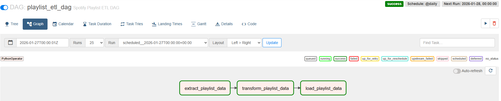
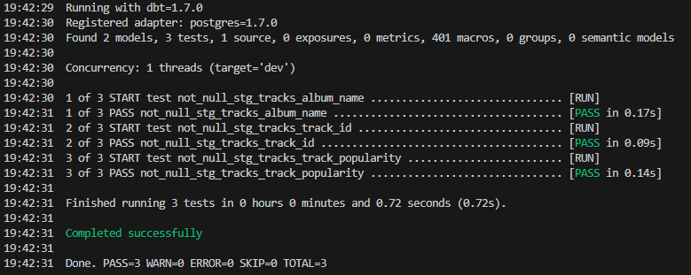

# 🎵 Spotify Playlist Analytics Pipeline

> **Containerized ETL pipeline** that ingests Spotify Web API data, transforms nested JSON into relational schemas, and exposes analytics through a Django web dashboard — with Apache Airflow orchestrating the batch pipeline and a REST API trigger connecting both systems.

[](https://python.org)
[](https://airflow.apache.org)
[](https://docker.com)
[](https://postgresql.org)
[](https://djangoproject.com)
[](https://www.getdbt.com)

---

## TL;DR

**What it does:** Extracts Spotify playlist data via API → Transforms & cleans with Pandas → Loads to PostgreSQL → dbt runs a staging + marts transformation layer → Serves analytics via Django dashboard

**Why it matters:** Demonstrates idempotent UPSERT operations, Airflow orchestration, shared database architecture, XCom-based task communication, dbt analytics engineering patterns, and dual-pattern ETL (scheduled batch + on-demand web)

**Key Tech:** Python · Apache Airflow · PostgreSQL · dbt Core · Django · Docker · Spotify Web API

**Demo:**
```bash
cd airflow && docker compose up -d        # Start Airflow 2.2.3 + PostgreSQL 13
cd ../playlist_analyzer && python manage.py runserver  # Start Django 5.2 web app
# Visit: http://localhost:8000 (Django) | http://localhost:8080 (Airflow)
```

---

## Architecture

This project consists of **three complementary systems** that share a unified PostgreSQL database and reuse the same Extract/Transform scripts.

```
                        +---------------------------+
                        |    Spotify Web API        |
                        |  (OAuth2 Client Creds)    |
                        +---------------------------+
                                    |
                    +---------------+---------------+
                    |                               |
                    v                               v
   +---------------------------------+   +----------------------+
   |  Airflow: playlist_etl_dag      |   |  Django 5.2 Web App  |
   |                                 |   |                      |
   |  extract_playlist_data          |   |  User submits URL    |
   |    -> raw_playlist_data.csv     |   |         |            |
   |         | (XCom: playlist_id)   |   |  extract + transform |
   |  transform_playlist_data        |   |  load_tracks_to_db   |
   |    -> cleaned_playlist_data.csv |   |  (Django ORM)        |
   |         | (XCom: playlist_id)   |   |         |            |
   |  load_playlist_data             |   |  Dashboard rendered  |
   |    UPSERT via SQLAlchemy        |   |  (top artists/genres)|
   +---------------------------------+   |         |            |
                    |                    |  trigger_airflow_dag |
                    |                    |  POST /dagRuns (async|
                    |                    |  5s timeout)         |
                    |                    +----------------------+
                    |                               |
                    v                               |
   +----------------------------------------------------+
   |          PostgreSQL 13 — playlist_db (port 5433)   |
   |                                                    |
   |  playlist_tracks        (raw ETL target, TEXT arr) |
   |  dashboard_playlist     (Django ORM, JSONB)        |
   |  dashboard_track        (Django ORM, JSONB)        |
   |  stg_tracks             (dbt view)                 |
   |  mart_track_stats       (dbt table)                |
   +----------------------------------------------------+
                    |
                    | (ExternalTaskSensor: waits for load_playlist_data)
                    v
   +---------------------------------+
   |  Airflow: dbt_transformation_dag|
   |                                 |
   |  dbt run                        |
   |    stg_tracks (view)            |
   |      clean + type-cast          |
   |      playlist_tracks            |
   |         |                       |
   |    mart_track_stats (table)     |
   |      album-level aggregations   |
   |      avg/max/min popularity     |
   |         |                       |
   |  dbt test                       |
   |    schema + data quality checks |
   +---------------------------------+
```

**Key architectural decisions:**
- **Django** runs ETL inline for immediate user feedback, then fires an async Airflow REST API trigger (5s timeout). The user never waits for the warehouse write.
- **dbt** runs in a dedicated container (`airflow-dbt-1`) triggered by a separate `dbt_transformation_dag` that gates on the ETL DAG via `ExternalTaskSensor`. Transformation logic stays versioned and testable independently of ingest.
- **Two DAGs, one database:** `playlist_etl_dag` owns ingest; `dbt_transformation_dag` owns transformation. Each has a single responsibility.

---

## Tech Stack

| Layer | Technology | Version |
|-------|-----------|---------|
| Orchestration | Apache Airflow (LocalExecutor) | 2.2.3 |
| Analytics transformation | dbt Core (Postgres adapter, dedicated container) | 1.7.0 |
| Containerization | Docker + Docker Compose | — |
| Backend / API | Django + Django REST views | 5.2 |
| Data transformation | Python, Pandas | 2.2+ |
| Storage | PostgreSQL (SQLAlchemy + psycopg2) | 13 |
| External API | Spotify Web API (OAuth2 Client Credentials) | — |
| ORM | SQLAlchemy (batch pipeline), Django ORM (web app) | 2.0+ |

---

## Key Features

### 1. Idempotent Data Loading — Two Implementations

**Airflow pipeline** uses PostgreSQL `INSERT ... ON CONFLICT DO UPDATE` (raw SQL UPSERT) via a staging-table pattern:
```sql
INSERT INTO playlist_tracks (playlist_id, track_id, track_name, ...)
SELECT playlist_id, track_id, track_name, ...
FROM temp_<random_hex>
ON CONFLICT (playlist_id, track_id) DO UPDATE SET
    track_name = EXCLUDED.track_name,
    track_popularity = EXCLUDED.track_popularity,
    track_genres = EXCLUDED.track_genres,
    ...;
DROP TABLE temp_<random_hex>;
```

**Django web app** implements UPSERT logic using the ORM: filter for existing record, update in-place, or bulk-create new records with `ignore_conflicts=True`.

Running either pipeline multiple times on the same playlist never creates duplicate rows — critical for scheduled ETL jobs and failure recovery.

### 2. DAG Trigger via Airflow REST API

When a user submits a playlist URL, Django immediately processes it for the dashboard, then fires an HTTP POST to the Airflow stable REST API (`/api/v1/dags/playlist_etl_dag/dagRuns`) with HTTP Basic Auth. The `playlist_id` is passed in `conf` and picked up by the DAG via `dag_run.conf`. This decouples real-time web requests from batch processing.

### 3. XCom-Based Task Communication

The DAG uses Airflow XCom to pass `playlist_id` from the extract task downstream to the load task, avoiding filesystem coupling between tasks for metadata:
```python
# Extract task pushes
context["task_instance"].xcom_push(key="playlist_id", value=playlist_id)

# Load task pulls
playlist_id = context["task_instance"].xcom_pull(task_ids="extract_playlist_data", key="playlist_id")
```

### 4. CSV File Staging Between DAG Tasks

The pipeline uses shared Docker volume paths as an intermediate handoff layer between tasks:
- Extract writes to `/opt/airflow/data/raw_playlist_data.csv`
- Transform reads from that path, writes to `/opt/airflow/data/cleaned_playlist_data.csv`
- Load reads the cleaned CSV and executes the UPSERT

This pattern keeps each task stateless and independently restartable.

### 5. Nested JSON Normalization

Spotify returns deeply nested JSON (tracks → artists → albums, artists → genres via a separate API endpoint). The extract layer flattens this by making per-artist API calls to enrich genre data, storing `artist_ids`, `artist_names`, and `track_genres` as Python lists. The transform layer handles mixed-type inputs (stringified lists from CSV vs. real lists from memory) via `ast.literal_eval`.

### 6. Dual Storage Format

The transform script exports cleaned data in two formats:
- **CSV** (`cleaned_playlist_data.csv`) — for PostgreSQL UPSERT via SQLAlchemy
- **Parquet** (`cleaned_playlist_data.parquet`) — for downstream analytics or archival

### 7. Dual JSONB vs TEXT Storage Strategy

The two systems store array fields differently — an intentional trade-off:
- **Airflow `playlist_tracks`**: Arrays stored as `TEXT` (JSON-serialized). Optimized for high-throughput bulk UPSERT via SQLAlchemy `.to_sql()` + raw SQL `CAST(... AS jsonb)`.
- **Django `dashboard_track`**: Arrays stored as PostgreSQL `JSONB` via Django's `JSONField`. Optimized for ORM-level querying and iteration in Python.

### 8. Environment-Aware Configuration

Both the ETL scripts and Django settings detect `ENV_MODE=local` vs `ENV_MODE=docker` and load from `.env.local` or `.env.docker` respectively. This enables the same codebase to run both locally and inside Docker containers without code changes.

### 9. API Rate Limiting Handling

The extract layer inserts a `time.sleep(0.1)` between each per-artist genre lookup call to respect Spotify's rate limits, and wraps each call in a try-except to skip gracefully on failures without aborting the entire extraction.

### 10. Comprehensive Testing Suite

Three test modules with 30+ test cases covering extraction mocking, transformation correctness, data quality schemas, Django model constraints, view authentication, and UPSERT idempotency. A QA report generator and SQL validation query set are also included.

---

## Project Structure

```
spotify-playlist-analyzer/
│
├── scripts/                              # Shared ETL scripts (used by both systems)
│   ├── extract.py                        # Spotify API ingestion with pagination & genre enrichment
│   ├── transform.py                      # Pandas normalization + CSV/Parquet export
│   └── load.py                           # PostgreSQL UPSERT via SQLAlchemy + raw SQL
│
├── airflow/                              # Airflow submodule + project DAGs
│   ├── dags/
│   │   ├── playlist_etl_dag.py           # Main DAG: extract_playlist_data → transform_playlist_data → load_playlist_data
│   │   ├── dbt_dag.py                    # dbt DAG: ExternalTaskSensor → dbt run → dbt test
│   │   └── hello.py                      # Sanity-check DAG (hello_airflow)
│   └── docker-compose.yml                # PostgreSQL 13 + Airflow 2.2.3 + dbt 1.7.0 containers
│
├── spotify_dbt/                          # dbt project (mounted into airflow-dbt-1 container)
│   ├── dbt_project.yml                   # Project config: staging→view, marts→table
│   ├── profiles.yml                      # PostgreSQL connection profile
│   └── models/
│       ├── staging/
│       │   └── stg_tracks.sql            # View: clean + type-cast playlist_tracks
│       └── marts/
│           └── mart_track_stats.sql      # Table: album-level aggregation via ref(stg_tracks)
│
├── playlist_analyzer/                    # Django 5.2 web application
│   ├── dashboard/
│   │   ├── models.py                     # Playlist, Track models (JSONField, unique_together)
│   │   ├── views.py                      # analyze_playlist, dashboard, user_playlists views
│   │   ├── urls.py                       # URL routing for dashboard app
│   │   ├── tests.py                      # Django model, view, and UPSERT tests
│   │   └── templates/
│   │       └── dashboard/
│   │           ├── index.html
│   │           ├── dashboard.html
│   │           └── user_playlists.html
│   ├── users/
│   │   ├── views.py                      # register view (UserCreationForm)
│   │   └── urls.py                       # register, login, logout routes
│   ├── playlist_analyzer/
│   │   ├── settings.py                   # PostgreSQL config, app registration
│   │   └── urls.py                       # Root URL config
│   └── manage.py
│
├── tests/                                # ETL unit tests & QA tooling
│   ├── test_extract.py                   # Spotify API mock tests (pagination, missing tracks)
│   ├── test_transform.py                 # Transformation correctness & edge cases
│   ├── test_data_quality.py              # JSON schema validation & business rule checks
│   ├── generate_qa_report.py             # QA report generator (JSON output)
│   ├── postman/
│   │   └── Spotify_API_Tests.postman_collection.json
│   └── sql/
│       └── data_quality_checks.sql       # 10 SQL validation queries against playlist_tracks
│
├── data/                                 # Data artifacts (gitignored in production)
│   ├── raw_playlist_data.csv
│   ├── cleaned_playlist_data.csv
│   └── cleaned_playlist_data.parquet
│
├── images/
│   └── airflow_playlist_dag.png          # Screenshot of DAG in Airflow UI
│
├── .env.local                            # Local dev config (Django + scripts)
├── .env.docker                           # Docker env config (Airflow container)
├── requirements.txt                      # Python dependencies
├── pytest.ini                            # Pytest config with Django settings module
└── TESTING.md                            # Detailed testing documentation
```

---

## Data Flow

### Airflow Pipeline (Batch)

```
Spotify Web API (OAuth2)
        ↓
extract_playlist_data task
  - sp.playlist() → playlist name, owner
  - sp.playlist_items(limit=100) → cursor-based pagination
  - sp.artist() per artist → genre enrichment (100ms sleep between calls)
  - Output: 12 fields per track → raw_playlist_data.csv
        ↓  [XCom: playlist_id]
transform_playlist_data task
  - album_release_date → pd.to_datetime, extract release_year
  - track_duration_ms / 1000 → track_duration_sec
  - track_popularity.fillna(0).astype(int)
  - album_name.fillna("Unknown")
  - ast.literal_eval on stringified list columns
  - Output: cleaned_playlist_data.csv + cleaned_playlist_data.parquet
        ↓  [XCom: playlist_id]
load_playlist_data task
  - df.to_sql() → temp_<random_hex> (staging table)
  - INSERT INTO playlist_tracks ... SELECT FROM temp ... ON CONFLICT DO UPDATE
  - DROP TABLE temp_<random_hex>
  - Target: PostgreSQL playlist_db.playlist_tracks
```

### Django Web Flow (On-Demand)

```
User POSTs Spotify playlist URL
        ↓
analyze_playlist view
  - Extract playlist_id from URL (split on "/" and "?")
  - spotify_api_setup() → SpotifyClientCredentials
  - extract_playlist_tracks() → raw DataFrame + metadata dict
  - transform_playlist_df() → cleaned DataFrame
  - Playlist.objects.get_or_create(user, playlist_id)
  - load_tracks_to_db(clean_df, playlist_obj)
    ├── Existing track → field-by-field update + .save()
    └── New track → append to list → bulk_create(ignore_conflicts=True)
  - Save cleaned CSV to webData/<playlist_id>_cleaned.csv
  - trigger_airflow_dag(playlist_id) → async HTTP POST (timeout=5s)
  - redirect to dashboard/<playlist_id>/
        ↓
dashboard view
  - Track.objects.filter(playlist=playlist_obj).select_related('playlist')
  - Counter() on artist_names and track_genres lists
  - top_artists = most_common(10), top_genres = most_common(10)
  - render dashboard.html with track_count, track_table, playlist metadata
```

---

## Database Schema

Both systems share the same PostgreSQL container (`playlist_db` on Docker port `5433`).

### Airflow ETL Table: `playlist_tracks`

Created automatically by `load.py` via `df.to_sql()` on first run:

```sql
CREATE TABLE playlist_tracks (
    playlist_id          TEXT,
    track_id             TEXT,
    track_name           TEXT,
    track_duration_ms    BIGINT,
    track_popularity     BIGINT,
    track_genres         JSONB,     -- Stored as TEXT in staging, CAST to JSONB on INSERT
    album_id             TEXT,
    album_name           TEXT,
    album_release_date   DATE,      -- CAST from TEXT during UPSERT
    album_label          TEXT,
    artist_ids           JSONB,     -- Stored as TEXT in staging, CAST to JSONB on INSERT
    artist_names         JSONB,     -- Stored as TEXT in staging, CAST to JSONB on INSERT
    release_year         BIGINT,
    track_duration_sec   DOUBLE PRECISION,
    CONSTRAINT playlist_tracks_pkey UNIQUE (playlist_id, track_id)
);
```

**UPSERT conflict key:** `(playlist_id, track_id)` — a track can appear in multiple playlists.

### Django ORM Tables: `dashboard_playlist`, `dashboard_track`

Created via `python manage.py migrate` from Django model definitions:

```sql
-- dashboard_playlist
CREATE TABLE dashboard_playlist (
    id                   BIGSERIAL PRIMARY KEY,
    user_id              INTEGER NOT NULL REFERENCES auth_user(id) ON DELETE CASCADE,
    playlist_id          VARCHAR(255) NOT NULL,
    playlist_url         VARCHAR(200) NOT NULL,
    playlist_name        VARCHAR(255) NOT NULL,
    playlist_owner       VARCHAR(255) NOT NULL,
    playlist_image       VARCHAR(200),
    playlist_description TEXT NOT NULL DEFAULT '',
    created_at           TIMESTAMPTZ NOT NULL DEFAULT now(),
    UNIQUE (user_id, playlist_id)
);

-- dashboard_track
CREATE TABLE dashboard_track (
    id                   BIGSERIAL PRIMARY KEY,
    playlist_id          BIGINT NOT NULL REFERENCES dashboard_playlist(id) ON DELETE CASCADE,
    track_id             VARCHAR(255) NOT NULL,
    track_name           VARCHAR(255) NOT NULL,
    track_duration_ms    INTEGER NOT NULL,
    track_popularity     INTEGER,
    track_genres         JSONB NOT NULL DEFAULT '[]',   -- Native JSONB via Django JSONField
    album_id             VARCHAR(255) NOT NULL,
    album_name           VARCHAR(255) NOT NULL,
    album_release_date   DATE,
    album_label          VARCHAR(255),
    artist_ids           JSONB NOT NULL DEFAULT '[]',
    artist_names         JSONB NOT NULL DEFAULT '[]',
    UNIQUE (playlist_id, track_id)
);
```

**Key difference from `playlist_tracks`:** The Django tables use true `JSONB` columns (not text-serialized), which enables ORM-level Python list iteration without deserialization.

---

## Airflow DAG: `playlist_etl_dag`

| Property | Value |
|----------|-------|
| DAG ID | `playlist_etl_dag` |
| Schedule | `@daily` |
| Start date | 2024-01-01 |
| Catchup | `False` |
| Tags | `["spotify", "ETL"]` |
| Executor | `LocalExecutor` |
| Retries | 1 (retry delay: 1 minute) |
| Default playlist | `1ssFFcU1hlZnKgNnDshd0F` |

**Task graph:**
```
extract_playlist_data >> transform_playlist_data >> load_playlist_data
```

All tasks are `PythonOperator` with `**context` passed through, enabling XCom access. The linear dependency chain (`>>`) was a deliberate choice to prevent race conditions on shared intermediate CSV files — if tasks ran in parallel, a concurrent write to `raw_playlist_data.csv` could corrupt the transform step.

**Triggering via Airflow REST API:**
```bash
curl -X POST http://localhost:8080/api/v1/dags/playlist_etl_dag/dagRuns \
  -H "Content-Type: application/json" \
  -u airflow:airflow \
  -d '{"conf": {"playlist_id": "1ssFFcU1hlZnKgNnDshd0F"}}'
```



---

## dbt Transformation Layer

dbt Core 1.7.0 runs in a dedicated Docker container (`airflow-dbt-1`, image: `ghcr.io/dbt-labs/dbt-postgres:1.7.0`) on the same `airflow-net` bridge network as PostgreSQL. It reads from the raw `playlist_tracks` table loaded by Airflow and produces clean, analytics-ready views and tables in `playlist_db`.

### DAG: `dbt_transformation_dag`

| Property | Value |
|----------|-------|
| DAG ID | `dbt_transformation_dag` |
| Schedule | `None` (triggered by sensor) |
| Trigger condition | `ExternalTaskSensor` waits for `load_playlist_data` in `playlist_etl_dag` |
| Tags | `["dbt", "spotify"]` |
| Retries | 1 (retry delay: 5 minutes) |

**Task graph:**
```
wait_for_etl (ExternalTaskSensor) >> dbt_run (BashOperator) >> dbt_test (BashOperator)
```

Tasks execute `docker exec airflow-dbt-1 dbt run` and `dbt test` from within the Airflow scheduler container, delegating all dbt work into the isolated dbt container.

### Models

#### `staging/stg_tracks` — View

Reads directly from the raw `playlist_tracks` table (defined as a dbt `source`). Selects and type-casts the columns needed downstream, dropping any rows where `track_id IS NULL`.

```sql
SELECT
    track_id,
    track_name,
    track_duration_sec,
    track_popularity,
    album_id,
    album_name,
    album_release_date::DATE AS release_date,
    release_year,
    artist_names,
    track_genres,
    playlist_id
FROM {{ source('spotify_raw', 'playlist_tracks') }}
WHERE track_id IS NOT NULL
```

Materialized as a **view** — always reflects the latest state of the source table without storing duplicate data.

#### `marts/mart_track_stats` — Table

Builds album-level aggregate statistics on top of `stg_tracks` using `{{ ref('stg_tracks') }}`, which makes the dependency explicit and lets dbt enforce run order.

```sql
SELECT
    album_name,
    release_year,
    COUNT(*)                                    AS track_count,
    ROUND(AVG(track_popularity), 1)             AS avg_popularity,
    ROUND(AVG(track_duration_sec)::NUMERIC, 1)  AS avg_duration_sec,
    MAX(track_popularity)                       AS max_popularity,
    MIN(track_popularity)                       AS min_popularity
FROM {{ ref('stg_tracks') }}
GROUP BY album_name, release_year
ORDER BY avg_popularity DESC
```

Materialized as a **table** — persisted for downstream BI queries without re-running the aggregation on each read.

### Model Materialization Strategy

| Model | Materialization | Why |
|-------|----------------|-----|
| `stg_tracks` | View | Zero storage cost; always fresh; source is append-only |
| `mart_track_stats` | Table | Pre-aggregated for fast analytics reads; aggregation is expensive to recompute per query |

### Project Structure

```
spotify_dbt/
├── dbt_project.yml          # Project config: staging→view, marts→table
├── profiles.yml             # PostgreSQL connection (playlist_db via airflow-net)
├── models/
│   ├── staging/
│   │   └── stg_tracks.sql   # Source: playlist_tracks → clean view
│   └── marts/
│       └── mart_track_stats.sql  # Ref: stg_tracks → album aggregation table
├── analyses/
├── macros/
├── seeds/
├── snapshots/
└── tests/                   # dbt schema + data tests (run via dbt test)
```

### Running dbt manually

```bash
# Exec into the running dbt container
docker exec -it airflow-dbt-1 bash

# Inside the container
dbt run          # Build all models (stg_tracks view + mart_track_stats table)
dbt test         # Run schema and data quality tests
dbt run --select stg_tracks          # Run a single model
dbt run --select mart_track_stats    # Run only the marts model

# Or invoke directly from the host
docker exec airflow-dbt-1 dbt run
docker exec airflow-dbt-1 dbt test
```

### Verifying dbt output in PostgreSQL

```bash
docker exec airflow-postgres-1 psql -U airflow -d playlist_db \
  -c "SELECT album_name, track_count, avg_popularity FROM mart_track_stats LIMIT 10;"
```

### dbt Test Results

[](./images/dbt_test_results.png)

---

## Django URL Routes

| Method | URL | View | Auth Required |
|--------|-----|------|---------------|
| GET | `/` | `index` | No |
| POST | `/analyze/` | `analyze_playlist` | Yes (403 if not logged in) |
| GET | `/dashboard/<playlist_id>/` | `dashboard` | Yes (user scoped) |
| GET | `/my-playlists/` | `user_playlists` | Yes (`@login_required`) |
| GET/POST | `/users/register/` | `register` | No |
| GET/POST | `/users/login/` | `LoginView` (built-in) | No |
| POST | `/users/logout/` | `LogoutView` (built-in) | — |

---

## Quick Start

### Prerequisites
- Docker Desktop
- Python 3.8+
- Spotify Developer account ([Get credentials](https://developer.spotify.com/dashboard))

### 1. Configure environment

Create `.env.local` in the project root:
```bash
# Spotify API
SPOTIPY_CLIENT_ID=your_client_id_here
SPOTIPY_CLIENT_SECRET=your_client_secret_here

# PostgreSQL (Docker container)
DB_NAME=playlist_db
DB_USER=airflow
DB_PASSWORD=airflow
DB_HOST=localhost
DB_PORT=5433

# Airflow integration (used by Django)
AIRFLOW_API_URL=http://localhost:8080
AIRFLOW_USER=airflow
AIRFLOW_PASSWORD=airflow

ENV_MODE=local
```

### 2. Start PostgreSQL + Airflow

```bash
cd airflow
docker compose up -d
```

This starts four containers on the `airflow-net` bridge network:
- `postgres` — PostgreSQL 13 on port `5433` (mapped from container's 5432)
- `airflow-webserver` — Airflow UI on port `8080`
- `airflow-scheduler` — DAG scheduler
- `airflow-worker` — Celery worker (idle in LocalExecutor mode)

The `scripts/` directory and `data/` directory are bind-mounted into the Airflow containers at `/opt/airflow/scripts` and `/opt/airflow/data`.

### 3. Set up Django

```bash
cd playlist_analyzer
pip install -r ../requirements.txt
python manage.py migrate          # Creates dashboard_playlist, dashboard_track, auth tables
python manage.py createsuperuser  # Create login credentials
python manage.py runserver        # Start on http://localhost:8000
```

### 4. Access points

| Service | URL | Credentials |
|---------|-----|-------------|
| Django app | http://localhost:8000 | Your superuser |
| Airflow UI | http://localhost:8080 | `airflow` / `airflow` |
| PostgreSQL | `localhost:5433` | `airflow` / `airflow` |

### 5. Verify the pipeline

```bash
# Check PostgreSQL data after analyzing a playlist
docker exec airflow-postgres-1 psql -U airflow -d playlist_db \
  -c "SELECT COUNT(*) FROM playlist_tracks;"

# Trigger DAG manually
curl -X POST http://localhost:8080/api/v1/dags/playlist_etl_dag/dagRuns \
  -u airflow:airflow \
  -H "Content-Type: application/json" \
  -d '{"conf": {"playlist_id": "1ssFFcU1hlZnKgNnDshd0F"}}'
```

### 6. Run ETL scripts directly (without Airflow)

```bash
python scripts/extract.py    # Writes data/raw_playlist_data.csv
python scripts/transform.py  # Writes data/cleaned_playlist_data.csv + .parquet
python scripts/load.py       # UPSERTs to PostgreSQL playlist_tracks table
```

---

## Testing

See [TESTING.md](TESTING.md) for the full testing guide.

### Test suite overview

| File | Scope | Key Tests |
|------|-------|-----------|
| `tests/test_extract.py` | Unit | Spotify API auth (local vs Docker env), pagination across 2 pages, `None` track skipping, genre enrichment |
| `tests/test_transform.py` | Unit | ms→sec conversion, date parsing, null handling (`popularity→0`, `album→"Unknown"`), `ast.literal_eval` for mixed list types, empty DataFrame edge case |
| `tests/test_data_quality.py` | Schema/Rules | JSON schema validation for Spotify track response, popularity range 0–100, date format, empty artists array, dtype assertions, business rule constraints |
| `playlist_analyzer/dashboard/tests.py` | Django | `Playlist`/`Track` model creation, `unique_together` constraint enforcement, `load_tracks_to_db` UPSERT behavior (update vs. create), view authentication, dashboard context data, end-to-end `analyze_playlist` with mocked ETL |
| `tests/sql/data_quality_checks.sql` | SQL | 10 validation queries: duplicate detection, NULL checks, popularity range, duration > 0, date range, JSONB type validation, UPSERT idempotency, cross-playlist consistency, statistical outliers |
| `tests/postman/Spotify_API_Tests.postman_collection.json` | API | Postman collection for manual API verification |

### Run tests

```bash
# ETL unit tests (from project root)
pytest tests/

# With coverage
pytest tests/ --cov=scripts --cov-report=html

# Django tests (from playlist_analyzer/)
cd playlist_analyzer
python manage.py test dashboard

# Specific test class
python manage.py test dashboard.tests.LoadTracksToDBTest

# Full QA report
python tests/generate_qa_report.py
```

### Test coverage targets

| Component | Target |
|-----------|--------|
| Extract Scripts | 90% |
| Transform Scripts | 95% |
| Django Models | 95% |
| Django Views | 85% |

---

## Design Decisions

**Why Airflow over a simple cron job?**
Cron has no visibility into task status, no retry logic, and no dependency management. Airflow provides DAG-level observability through its web UI, task-level retries with configurable backoff, XCom for inter-task communication, and makes the pipeline self-documenting as code. The DAG definition file is the single source of truth for pipeline structure.

**Why Docker Compose?**
Airflow requires multiple cooperating services (webserver, scheduler, worker, metadata database). Compose keeps the entire environment reproducible in a single `docker-compose up`, with bind-mounted volumes giving the Airflow containers access to the same `scripts/` and `data/` directories used during local development. Port `5433` is used for PostgreSQL (instead of the default `5432`) to avoid conflicts with any local PostgreSQL installation.

**Why PostgreSQL over SQLite for Django?**
Concurrent writes from Airflow workers and the Django web server require proper transaction isolation. SQLite's file-level locking makes it unsuitable for multi-process ETL workloads. PostgreSQL also provides native `JSONB` columns, enabling efficient storage and querying of the array fields (genres, artist IDs, artist names) that the Spotify API returns.

**Why two separate load implementations (raw SQL vs. Django ORM)?**
The Airflow pipeline prioritizes throughput: bulk-loading via `df.to_sql()` into a staging table and executing a single atomic UPSERT SQL statement is significantly faster than row-by-row ORM operations for batch workloads. Django's ORM implementation prioritizes code clarity, database-agnosticism (works on SQLite in dev, PostgreSQL in production), and integration with Django's model layer (signals, admin, migrations).

**Why store arrays as TEXT in `playlist_tracks` but JSONB in `dashboard_track`?**
`df.to_sql()` via SQLAlchemy cannot natively write Python lists as PostgreSQL JSONB — it needs an intermediate TEXT representation. The UPSERT SQL then uses `CAST(... AS jsonb)` during the insert. Django's `JSONField` handles the Python↔JSONB serialization automatically in the ORM layer, making it the natural choice for the application tables.

**Why does Django trigger Airflow instead of just running ETL inline?**
Django already runs the ETL inline for immediate user feedback (dashboard renders in ~15–20 seconds). Triggering Airflow in parallel — with a 5-second timeout so a down Airflow instance never blocks the user — populates the centralized analytics warehouse without adding latency to the web request. This pattern mirrors production architectures where web applications emit events and batch systems consume them asynchronously.

**Why enforce `extract >> transform >> load` as a strict linear chain?**
The three tasks share intermediate CSV files on the Airflow data volume. If `transform_playlist_data` and `extract_playlist_data` ran concurrently across separate DAG runs, they could race on `raw_playlist_data.csv`. The explicit `>>` chain makes each task's input dependency clear and prevents this class of bug without requiring locks.

---

## Future Improvements

- [ ] Migrate to Snowflake or BigQuery for cloud-native analytics at scale
- [ ] Metabase or Apache Superset dashboard connected directly to PostgreSQL
- [ ] CI/CD pipeline with GitHub Actions for automated DAG validation and test runs
- [ ] Celery + Redis for async Spotify API calls in Django (avoid blocking web workers)
- [ ] Incremental loading using Spotify's `snapshot_id` for change data capture
- [ ] Data catalog / lineage tracking (Apache Atlas or OpenLineage)
- [ ] Production deployment: Gunicorn + Nginx for Django, Kubernetes for Airflow

---

## Skills Demonstrated

`ETL Pipeline Design` · `Apache Airflow DAG Development` · `dbt Core (Staging + Marts)` · `Docker / Compose` · `PostgreSQL` · `SQLAlchemy` · `Django 5` · `Pandas` · `OAuth2` · `Idempotent UPSERT` · `XCom Task Communication` · `REST API Integration` · `JSON Schema Validation` · `Unit & Integration Testing` · `System Architecture` · `Dual-Pattern ETL`
